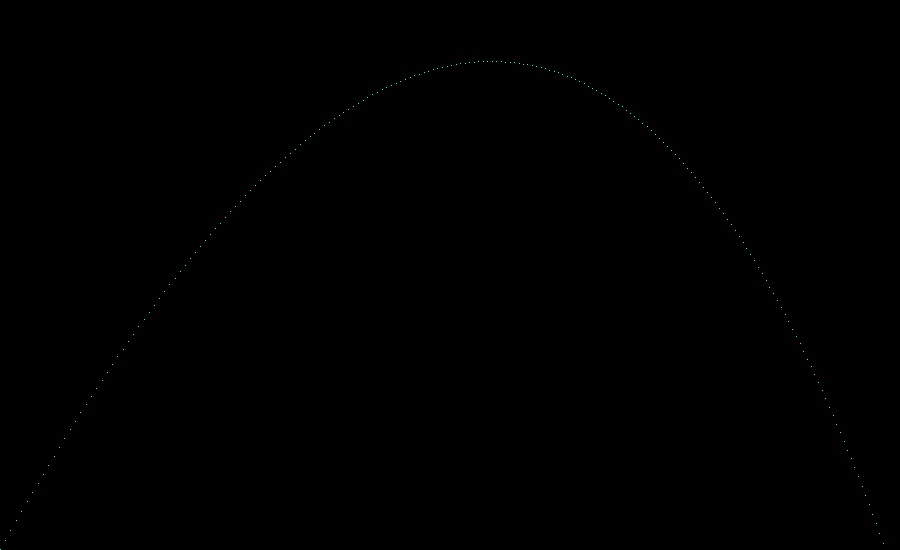

# Putting it together

This section contains the result of each chapter:

- [Chapter 1](#chapter-1)
- [Chapter 2](#chapter-2)

## Chapter 1

Just text output for this one:

```
> runMain org.bbstilson.raytracer.Chapter1
[info] Running org.bbstilson.raytracer.Chapter1
Projectile(Point(0.7071067811865475,1.7071067811865475,0.0),Vector(0.6971067811865475,0.6071067811865475,0.0))
Projectile(Point(1.404213562373095,2.314213562373095,0.0),Vector(0.6871067811865474,0.5071067811865475,0.0))
Projectile(Point(2.0913203435596426,2.821320343559642,0.0),Vector(0.6771067811865474,0.40710678118654753,0.0))
Projectile(Point(2.7684271247461902,3.2284271247461898,0.0),Vector(0.6671067811865474,0.30710678118654755,0.0))
Projectile(Point(3.4355339059327377,3.5355339059327373,0.0),Vector(0.6571067811865474,0.20710678118654754,0.0))
Projectile(Point(4.092640687119285,3.7426406871192848,0.0),Vector(0.6471067811865474,0.10710678118654754,0.0))
Projectile(Point(4.739747468305833,3.849747468305832,0.0),Vector(0.6371067811865474,0.007106781186547534,0.0))
Projectile(Point(5.37685424949238,3.85685424949238,0.0),Vector(0.6271067811865474,-0.09289321881345247,0.0))
Projectile(Point(6.003961030678928,3.7639610306789275,0.0),Vector(0.6171067811865474,-0.19289321881345248,0.0))
Projectile(Point(6.621067811865475,3.571067811865475,0.0),Vector(0.6071067811865474,-0.2928932188134525,0.0))
Projectile(Point(7.228174593052023,3.2781745930520225,0.0),Vector(0.5971067811865474,-0.3928932188134525,0.0))
Projectile(Point(7.82528137423857,2.88528137423857,0.0),Vector(0.5871067811865474,-0.4928932188134525,0.0))
Projectile(Point(8.412388155425118,2.3923881554251176,0.0),Vector(0.5771067811865473,-0.5928932188134525,0.0))
Projectile(Point(8.989494936611665,1.7994949366116653,0.0),Vector(0.5671067811865473,-0.6928932188134524,0.0))
Projectile(Point(9.556601717798213,1.1066017177982128,0.0),Vector(0.5571067811865473,-0.7928932188134524,0.0))
Projectile(Point(10.11370849898476,0.3137084989847604,0.0),Vector(0.5471067811865473,-0.8928932188134524,0.0))
Projectile(Point(10.660815280171308,-0.579184719828692,0.0),Vector(0.5371067811865473,-0.9928932188134524,0.0))
```

## Chapter 2


